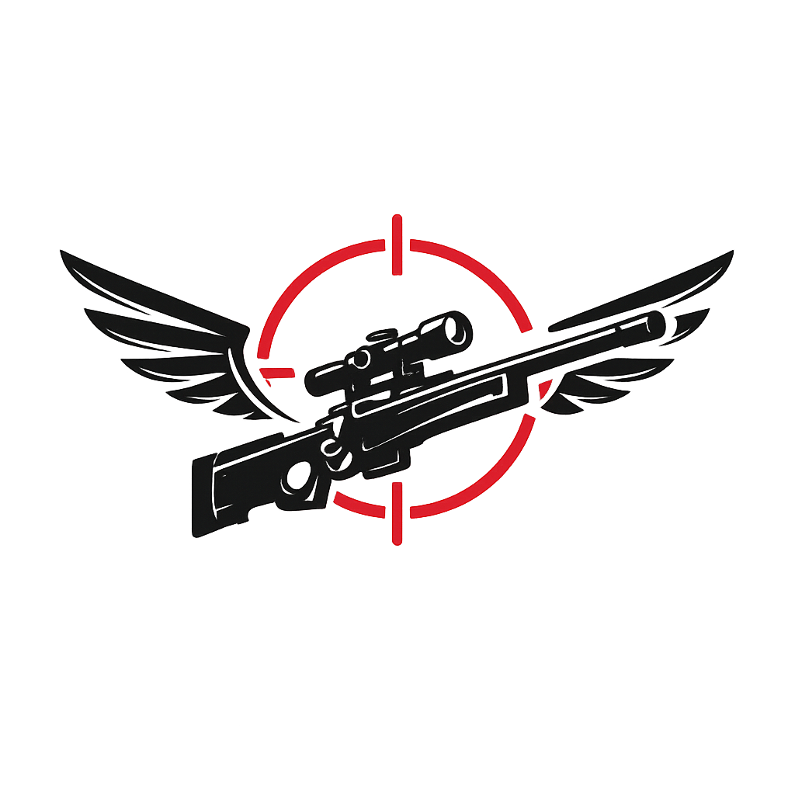

<div align="center">
  

  # Fallenshot

  **A Wayland-native screenshot annotation tool for GNOME.**  
  Capture, annotate, copy and save — no X11, no hacks.

  
  
  
  
</div>

---

## What is Fallenshot?

Fallenshot is a lightweight screenshot annotation tool built specifically for **Wayland** on GNOME. It uses the **xdg-desktop-portal** to capture your screen natively — no XWayland, no screen grabbing hacks.

After capturing, a fullscreen editor opens where you can draw rectangles, lines, arrows and add text directly on the screenshot. When you're done, copy to clipboard or save as PNG with one click.

> ⚠️ **Tested on:** GNOME Shell 49 (Ubuntu 25.04+) on Wayland.  
> Other compositors (KDE Plasma, Sway) may work but are not officially supported yet.

---

## Features

| Feature | Status |
|---|---|
| Wayland-native capture via xdg-desktop-portal | ✅ |
| Rectangle, Line, Arrow, Text tools | ✅ |
| Color picker (6 colors) | ✅ |
| Stroke thickness (thin / thick) | ✅ |
| Undo | ✅ |
| Copy to clipboard (`wl-copy`) | ✅ |
| Save as PNG with file chooser | ✅ |
| Auto filename `fallenshot-YYYYMMDD-HHMMSS.png` | ✅ |
| GNOME launcher integration (.desktop + icon) | ✅ |
| Keyboard shortcuts | ✅ |

---

## Keyboard Shortcuts

| Key | Action |
|---|---|
| `R` | Rectangle tool |
| `L` | Line tool |
| `A` | Arrow tool |
| `T` | Text tool |
| `C` | Cycle color |
| `Ctrl+C` | Copy to clipboard |
| `Ctrl+S` | Save PNG |
| `Ctrl+Z` | Undo |
| `Esc` | Exit |

---

## Dependencies

### System packages (apt)

```bash
sudo apt install \
  python3 \
  python3-gi \
  python3-gi-cairo \
  python3-dbus \
  gir1.2-gtk-4.0 \
  gir1.2-gdkpixbuf-2.0 \
  xdg-desktop-portal \
  xdg-desktop-portal-gnome \
  wl-clipboard
```

> `wl-clipboard` provides `wl-copy`, required for clipboard support on Wayland.

### Python packages

All GTK/GLib bindings come from the system packages above.  
No `pip install` required.

---

## Installation

```bash
git clone https://github.com/your-user/fallenshot.git
cd fallenshot
./install.sh
```

The installer will:
- Check and install any missing system dependencies
- Create a symlink at `~/.local/bin/fallenshot`
- Install the app icon to `~/.local/share/icons/hicolor/256x256/apps/`
- Register the `.desktop` entry so Fallenshot appears in the GNOME app launcher

> ℹ️ After installing, you may need to **log out and back in** for the GNOME launcher icon to appear.

---

## Running

```bash
fallenshot
# or if ~/.local/bin is not in your PATH:
./fallenshot
```

---

## Binding to PrintScreen

1. Open **GNOME Settings → Keyboard → Keyboard Shortcuts → Custom Shortcuts**
2. Click **+** and fill in:
   - **Name:** Fallenshot
   - **Command:** `/home/YOUR_USER/.local/bin/fallenshot`
   - **Shortcut:** `Print`

---

## How it works

```
PrintScreen pressed
       │
       ▼
xdg-desktop-portal (DBus)
       │  GNOME shows its native screenshot UI
       ▼
GdkPixbuf loaded from captured PNG
       │
       ▼
Fallenshot fullscreen editor
  ┌────────────────────────┐
  │  Screenshot as canvas  │
  │  Draw shapes on top    │
  │  Toolbar at the bottom │
  └────────────────────────┘
       │
  Copy (wl-copy) or Save (PNG file chooser)
```

---

## Project Structure

```
fallenshot/
├── fallenshot           # Executable entry point
├── install.sh           # Installer script
├── icons/
│   └── fallenshot.png   # App icon
├── io.github.fallenshot.desktop
└── src/
    ├── main.py          # Gtk.Application, app lifecycle
    ├── capture.py       # xdg-desktop-portal screenshot via DBus
    ├── overlay.py       # Fullscreen annotation window (GTK4 + Cairo)
    ├── drawing.py       # Shape classes: Rectangle, Line, Arrow, Text
    └── export.py        # Clipboard (wl-copy) and PNG save
```

---

## Known Limitations

- **GNOME only (for now):** The xdg-desktop-portal backend for screenshots is only well-supported on GNOME 49. KDE and wlroots-based compositors may require a different portal backend.
- **No multi-monitor selection UI:** The GNOME portal handles monitor selection in its own UI.
- **No blur/pixelate tool:** Planned for future versions.
- **No HiDPI auto-scaling:** Shapes may appear at different visual sizes on HiDPI displays.

---

## License

MIT © Fallenshot contributors
